Contour Operations
==================

Contour theories provides many contour operations. Eight of them are
implemented in MusiContour:

.. index:: Retrograde

Retrograde
----------

Reverse :term:`cseg <Cseg>`.

For instance::

 A < 0 1 2 3 >

 Retrograde(A) = < 3 2 1 0 >

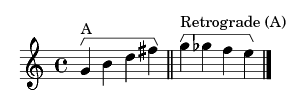

.. index:: Inversion

Inversion
---------

[Morris, 1987]

The :term:`cseg <Cseg>` horizontal inversion. The cseg is renumbered
under `Morris (1987) <contour-theories.html>`_ inversion formula::

 I(x)n = n - x

where n = highest :term:`cpitch <Cpitch>` in cseg, and x is each
cpitch in cseg.

For instance::

 A < 5 3 4 1 2 0 >

 n = 5

 I(5)5 = 5 - 5 = 0
 I(3)5 = 5 - 3 = 2
 I(4)5 = 5 - 4 = 1
 I(1)5 = 5 - 1 = 4
 I(2)5 = 5 - 2 = 3
 I(0)5 = 5 - 0 = 5

Thus::

 Inversion(A) = <0 2 1 4 3 5>

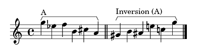

.. index:: Rotation

Rotation
--------

In rotation the :term:`cseg <Cseg>` is split and the primer
:term:`cpitches <Cpitch>` become the last ones. It accepts a rotation
parameter.

For instance::

 A = < 0 1 2 3 >

 Rotation(A, 1) = < 1 2 3 0 >
 Rotation(A, 2) = < 2 3 0 1 >
 Rotation(A, 3) = < 3 0 1 2 >

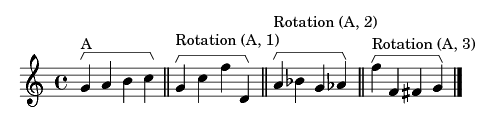

.. index:: Normal form
.. index:: Translation

Normal form (translation)
-------------------------

[Marvin and Laprade, 1987]

A contour is in its Normal form when reenumerated in integers from 0
to lower cpitch to ``(n - 1)`` to highest cpitch, where n is the
contour cardinality. Normal form is accomplished by translation
operation.

For instance::

 A = < 2 5 8 9 1 >
 Translation(A) = < 1 2 3 4 0 >

 B = < 3 34 21 55 >
 Translation(B) = < 0 2 1 3 >

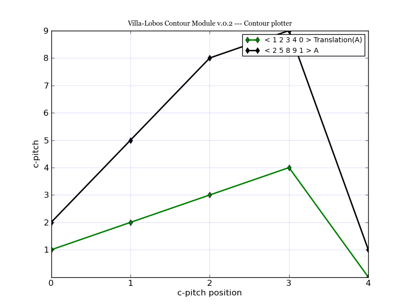

.. index:: Prime form

Prime form
----------

[Marvin and Laprade, 1987]

The Prime form is calculated by Marvin and Laprade Prime Form
Algorithm `(1987) <contour-theories.html>`_::

 1) Translate, if not consecutive integers 0 to (n - 1):
 2) Invert, if [(n - 1) - last cpitch] < first cpitch
 3) Retrograde, if last cpitch < first cpitch

For instance::

 A < 3 0 2 1 >
 2) Inversion(A) = < 0 3 1 2 >

 B < 1 2 0 4 >
 1) Translation(B) = B' < 1 2 0 3>
 2) Invertion(B') = B'' < 2 1 3 0 >
 3) Retrograde(B'') = < 0 3 1 2 >

In this example, A and B have the same prime form::

 < 0 3 1 2 >

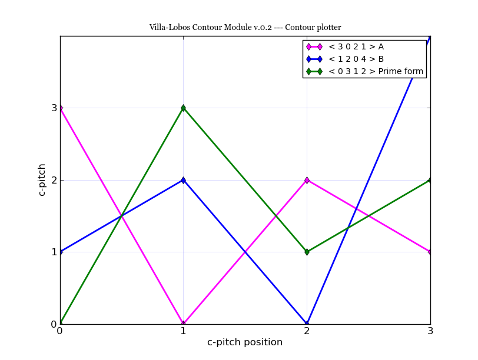

In GUI, Prime form operation returns also the contour segment class
number, like in Marvin and Laprade C-space segment-classes table
`(1987) <contour-theories.html>`_.

For example::

 A < 5 2 9 4 1 3 >
 Prime form(A) = 6-163 < 1 4 0 2 5 3 >

The pair 6-163 means cardinality and Prime form order.

.. index:: Comparison Matrix
.. index:: COM-Matrix

Comparison Matrix
-----------------

[Morris, 1987]

Comparison Matrix (also known as COM-Matrix) returns a matrix with
comparison between all elements of a contour. The result of a
comparison is 0, + ou -. The Comparison Matrix is described by `Morris
(1987) <contour-theories.html>`_.

For example, matrix for ``< 0 3 1 2 >``::

   | 0 3 1 2
 -----------
 0 | 0 + + +
 3 | - 0 - -
 1 | - + 0 +
 2 | - + - 0

In this example, in the first line, all cpitches of cseg are compared
with first column element, 0. So, assuming that ``COM(a, b)`` is the
comparison function between a and b elements::

 COM(0, 0) = 0
 COM(0, 3) = +
 COM(0, 1) = +
 COM(0, 2) = +

 COM(3, 0) = -
 COM(3, 3) = 0
 COM(3, 1) = -
 COM(3, 2) = -

Internal Diagonal
-----------------

[Morris, 1987]

The Internal diagonals are yanked from the Comparison Matrix, from top
left to bottom right, above the main diagonal. The main diagonal is
filled by zeros.

In this figure, INT_1, INT_2, and INT_3 means internal diagonal 1, 2,
and 3.

.. figure:: figs/internal_diagonals.png

For this Comparison matrix, internal diagonals are::

 Internal diagonal(1) = < + - + >
 Internal diagonal(2) = < + - >
 Internal diagonal(3) = < + >

Michael Friedmann `(1985) <bibliography.html>`_ named the ups and
downs of a contour as Contour Adjacency Series.

.. index:: Subsets

Subsets
-------

Returns subsets from a contour with a given :term:`cardinality <Cardinality>`.

For example, for a given contour A, all 3 elements subsets::

 A < 0 3 1 2 >
 Subsets(3) =  < 0 1 2 >, < 0 3 1 >, < 0 3 2 >, < 3 1 2 >

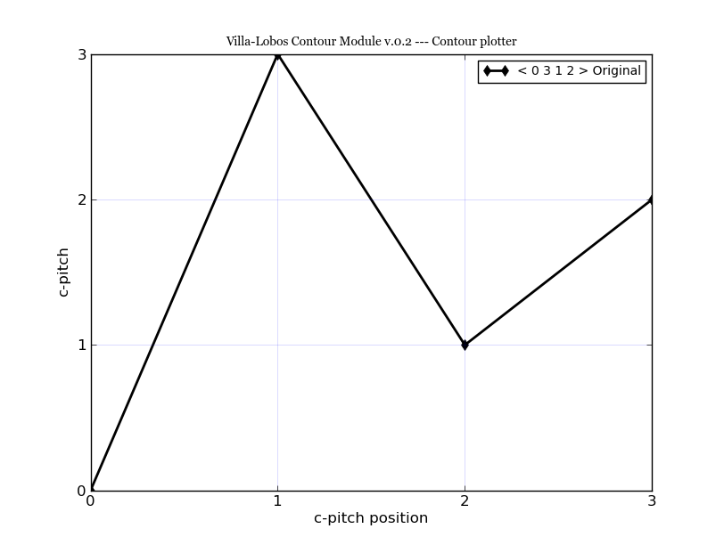

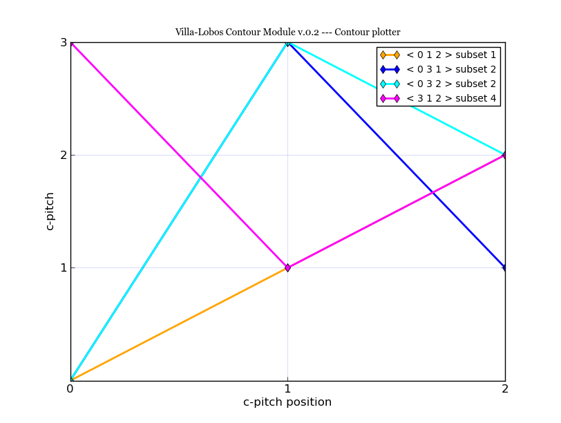

.. index:: Contour segments for an internal diagonal

Contour segments for an internal diagonal
-----------------------------------------

[Friedmann, 1985]

Returns all possible csegs for a given internal diagonal.

For instance::

 INT(1) = < - + - >
 Possible csegs:
 < 1 0 3 2 >
 < 2 0 3 1 >
 < 2 1 3 0 >
 < 3 0 2 1 >
 < 3 1 2 0 >

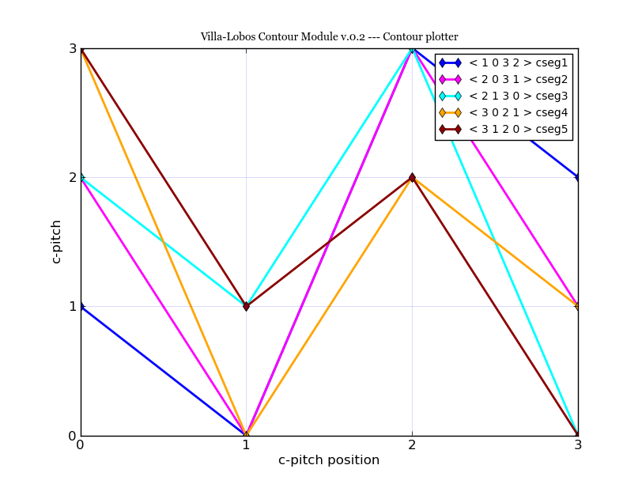

The other internal diagonals can be used as input::

 INT(2) = < - + >
 Csegs:
 < 1 2 0 3 >
 < 2 0 1 3 >
 < 2 1 0 3 >
 < 3 0 1 2 >
 < 3 0 2 1 >
 < 3 1 0 2 >

In MusiContour GUI, the internal diagonal must be given with 1 and -1,
and internal number must be in secondary entry::

 Main entry: -1 1 -1
 Second. entry: 1

.. index:: Contour Adjacency Series Vector (CASV)

Contour Adjacency Series Vector (CASV)
--------------------------------------

[Friedmann, 1985]

Two digit summation of ascendent and descendent movements in Contour
Adjacency Series (Internal diagonal 1) of a contour segment. The first
digit signifies ups, and second, downs. Also known as CASV.

For instance::

 A < 0 4 1 3 2 5 >
 Internal diagonal(A, 1): < + - + - + >
 ups: 3
 downs: 2
 Contour Adjacency Series Vector(A): < 3 , 2 >

.. index:: Contour Interval Succession (CIS)

Contour Interval Succession (CIS)
---------------------------------

[Friedmann, 1985]

A succession of all adjacent
:term:`contour intervals <Contour Interval (CI)>` in a cseg. Also
known as CIS.

For instance::

 A < 0 4 1 >
 Contour Interval Succession(A): < +4, -1 >

 B < 0 3 2 4 >
 Contour Interval Succession(B): < +3, -1, +2 >

.. index:: Contour Interval Array (CIA)

Contour Interval Array (CIA)
----------------------------

[Friedmann, 1985]

An array with the multiplicity of
:term:`contour intervals <Contour Interval (CI)>` types in a cseg.

For instance::

 A < 0 3 2 4 >
 Contour Interval Array(A): [[1, 2, 1], [1, 0, 0]]

Cseg A has one ascendent contour interval of type 1 (3 4), two of type
2 (0 2 and 2 4), one of type 3: (0 3). Cseg A has also one descendent
contour interval of type -1: (3 2), and zero contour interval of types
-2 and -3.

.. index:: Contour Class Vector I (CCVI)

Contour Class Vector I (CCVI)
-----------------------------

[Friedmann, 1985]

Two digit summation of the frequency of ascendent and descendent
movements. Final result is the sum of number of elements and contour
interval multiplication.

For instance::

 A < 0 3 2 4 >
 Contour Interval Array(A): [[1, 2, 1], [1, 0, 0]]
 Contour Class Vector I(A): [8, 1]

 Contour Class Vector I(A): [(1*1)+(2*2)+(3*1), (1*1)+(2*0)+(3*0)]

.. index:: Contour Class Vector II (CCVII)

Contour Class Vector II (CCVII)
-------------------------------

[Friedmann, 1985]

Two digit summation of the frequency of ups and downs. Final result is
the sum of number of elements of a
:term:`contour interval <Contour Interval (CI)>` type.

For instance::

 A < 0 3 2 4 >
 Contour IInterval Array(A): [[1, 2, 1], [1, 0, 0]]
 Contour Class Vector II(A): [4, 1]

 Contour Class Vector II(A): [1+2+1, 1+0+0]

.. index:: Contour Similarity

Contour Similarity
------------------

[Marvin and Laprade, 1987]

A numeric measure for similarity between csegs with the same
:term:`cardinality <Cardinality>`. It varies from 0 to 1, representing
minimum to maximum similarity. Each specific position of comparison
matrix superior triangle of one contour segment is compared with the
corresponding position in the other contour segment. The similarity
value is given by the quotient between sum of similar content
positions and total of positions.

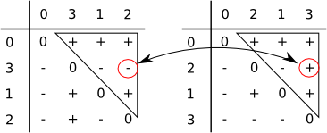

For instance, these two contour segments, ``< 0 3 1 2 >`` and ``< 0 2
1 3 >`` differ in comparison matrix superior triangle only in one
position (marked in figure). Five of six positions have the same value
in both segments. Thus, contour similarity is 5/6, or 0.83.

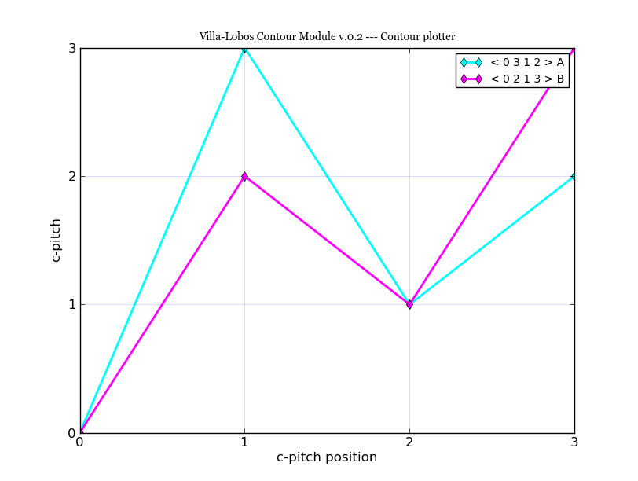

In MusiContour GUI, the contour segments must be input in main and
secondary entries. For instance::

 Main entry: 0 3 1 2
 Second. entry: 0 2 1 3

All Mutually Embedded Contour Segments (ACMEMB)
-----------------------------------------------

[Marvin and Laprade, 1987]

A numeric measure for similarity between two csegs of different or
similar cardinality. The number of all csubsegs mutually embedded in
both csegs is divided by the total of possible csubsegs in both
csegs. For instance, two csegs C1 < 0 3 1 2 4 >, and C2 < 0 2 1 3 >
have 37 possible csubsegs in common, and 32 mutually embedded
csubsegs. Thus ACMEMB(C1, C2) = 0.86.

C1 < 0 3 1 2 4 > csubsegs (grouped by normal form)::

   Normal form < 0 1 > (8 csubsegs)
   < 0 1 >
   < 0 2 >
   < 0 3 >
   < 0 4 >
   < 1 2 >
   < 1 4 >
   < 2 4 >
   < 3 4 >
   Normal form < 1 0 > (2 csubsegs)
   < 3 1 >
   < 3 2 >
   Normal form < 0 1 2 > (5 csubsegs)
   < 0 1 2 >
   < 0 1 4 >
   < 0 2 4 >
   < 0 3 4 >
   < 1 2 4 >
   Normal form < 0 2 1 > (2 csubsegs)
   < 0 3 1 >
   < 0 3 2 >
   Normal form < 1 0 2 > (2 csubsegs)
   < 3 1 4 >
   < 3 2 4 >
   Normal form < 2 0 1 > (1 cusbseg)
   < 3 1 2 >
   Normal form < 0 1 2 3 > (1 csubseg)
   < 0 1 2 4 >
   Normal form < 0 2 1 3 > (2 csubsegs)
   < 0 3 1 4 >
   < 0 3 2 4 >
   Normal form < 0 3 1 2 > (1 csubseg)
   < 0 3 1 2 >
   Normal form < 2 0 1 3 > (1 csubseg)
   < 3 1 2 4 >
   Normal form < 0 3 1 2 4 > (1 csubseg)
   < 0 3 1 2 4 >

C2 < 0 2 1 3 > csubsegs (grouped by normal form)::

   Normal form < 0 1 > (5 csubsegs)
   < 0 1 >
   < 0 2 >
   < 0 3 >
   < 1 3 >
   < 2 3 >
   Normal form < 1 0 > (1 csubseg)
   < 2 1 >
   Normal form < 0 1 2 > (2 csubsegs)
   < 0 1 3 >
   < 0 2 3 >
   Normal form < 0 2 1 > (1 csubseg)
   < 0 2 1 >
   Normal form < 1 0 2 > (1 csubseg)
   < 2 1 3 >
   Normal form < 0 2 1 3 > (1 csubseg)
   < 0 2 1 3 >

These embedded csubsegs can be visualized in plot or comparison matrix
representations. For instance, cseg < 0 3 1 2 4 > has 10 embedded
csubsegs with cardinality 3 (see figure below).

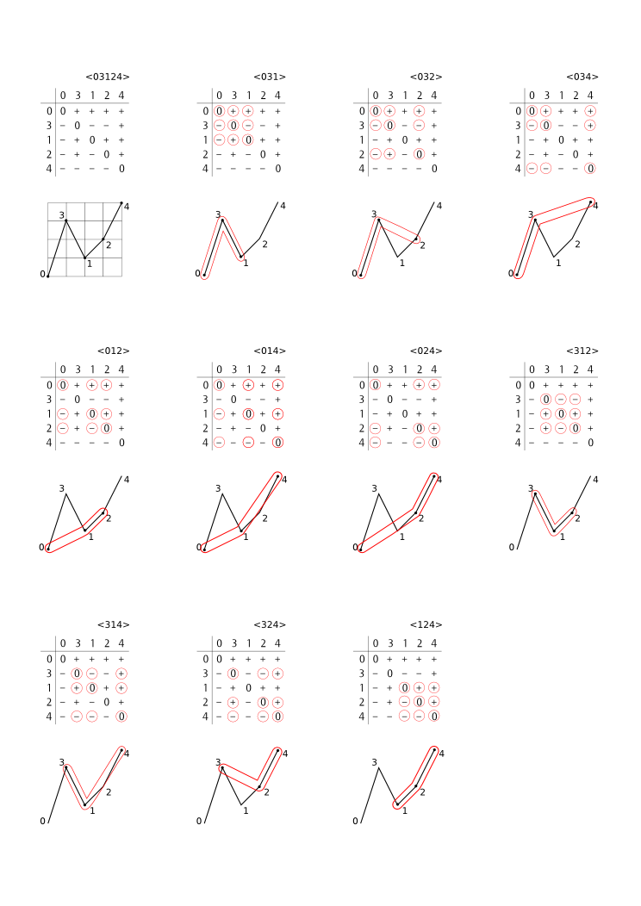

Operations Comparison
---------------------

Operations Relations returns Translation, Prime form, Inversion,
Retrograde, Morris Reduction and Internal Diagonals operations
relations between two csegs. For instance, two csegs C1 < 0 1 2 3 >,
and C2 < 9 5 3 1 > have these operations relations::

           inversion(< 9 5 3 1 >) = original(< 0 1 2 3 >)
           inversion(< 9 5 3 1 >) = translation(< 0 1 2 3 >)
           inversion(< 9 5 3 1 >) = prime_form(< 0 1 2 3 >)
           prime_form(< 9 5 3 1 >) = original(< 0 1 2 3 >)
           prime_form(< 9 5 3 1 >) = translation(< 0 1 2 3 >)
           prime_form(< 9 5 3 1 >) = prime_form(< 0 1 2 3 >)
           original(< 0 1 2 3 >) = retrograde(< 9 5 3 1 >)
           retrograde(< 9 5 3 1 >) = translation(< 0 1 2 3 >)
           retrograde(< 9 5 3 1 >) = prime_form(< 0 1 2 3 >)
           translation(< 9 5 3 1 >) = retrograde(< 0 1 2 3 >)
           translation(< 9 5 3 1 >) = inversion(< 0 1 2 3 >)
           retrograde(< 0 1 2 3 >) = original(< 9 5 3 1 >)
           inversion(< 0 1 2 3 >) = original(< 9 5 3 1 >)

Morris Contour Reduction Algorithm
----------------------------------

[Morris, 1993]

The Morris Contour Reduction Algorithm reduces a contour to a "contour
reduction prime form" prunning :term:`cpitches <Cpitch>` in steps
until no more cpitch can be deleted. The greater the number of steps,
greater the reduction depth. The basic reduction idea is that each
group of 3 adjacent cpitches in a same direction, like < 1 2 3 > or <
6 3 2 > have the second cpitch prunned, becoming < 1 3 > and < 6 2 >.

Thus, given three adjacent cpitches, if the second one is greater or
equal to the others, this second cpitch is called maximum pitch. If
this second pitch is less or equal than the others, it's called
minimum pitch. For instance, given a cseg < 3 8 7 >, the cpitch 8 is a
maximum pitch, and given a cseg < 5 2 2 >, the cpitch 2 is a minimum
pitch. The < 3 8 7 > cseg has not a minimum pitch, as < 5 2 2 > cseg
has not a maximum pitch. A set of maximum pitches is called maxima and
a set of minimum pitches is called minima. First and last cpitches are
both maximum and minimum pitches by definition.

For instance, a cseg < 1 6 9 3 2 4 > has < 1 9 4 > as maxima, and < 1
2 4 > as minima.

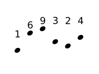

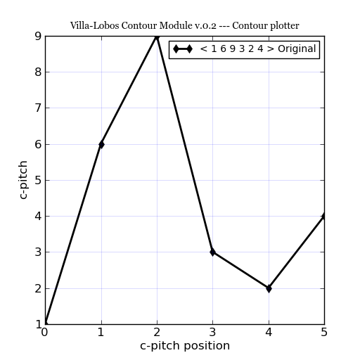

The non-flagged cpitches, that is, the cpitches that are not in maxima
AND minima, are prunned. In the example, cpitches 6 and 3 are
prunned. The contour is reduced to < 1 9 2 4 >, depth is increased in
1, repeated adjacent cpitches like < 2 2 > are prunned, and
maxima/minima flagging restarts.

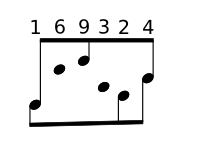

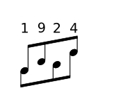

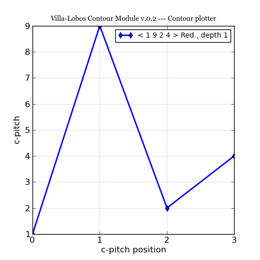

This algorithm is formalized in this way (Morris 1993, p.212)::

Given a contour C, and a variable N.

0. Set N to 0
1. Flag all maxima in C; call the resulting set the max-list.
2. Flag all minima in C; call the resulting set the min-list.
3. If all pitches in C are flagged, go to step 9.
4. Delete all non-flagged pitches in C.
5. N is incremented by 1 (i.e., N becomes N+1)
6. Flag all maxima in max-list. For any string of equal and adjacent minima in min list, either: (1) flag only one of them; or (2) if one pitch in the string is the first or last pitch of C, flag only it; or (3) if both the first and last pitch of C are in the string, flag (only) both the first and last pitch of C.
7. Flag all minima in min-list. For any string of equal and adjacent minima in min list, either: (1) flag only one of them; or (2) if one pitch in the string is the first or last pitch of C, flag only it; or (3) if both the first and last pitch of C are in the string, flag (only) both the first and last pitch of C.
8. Go to step 3.
9. End. N is the "depth" of the original contour C.
