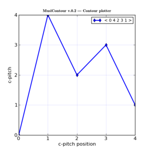

.. MusiContour master file, created by
   sphinx-quickstart on Sun Apr 18 14:14:51 2010.
   You can adapt this file completely to your liking, but it should at least
   contain the root `toctree` directive.

MusiContour
===========

MusiContour is a musical contour relations calculator, that plots and
calculates mathematical operations on musical contours. MusiContour
has a few `Contour Theories <contour-theories.html>`_ functions
implemented, like prime form, comparison matrix and internal
diagonals.

MusiContour is designed for Linux, but also runs in Windows. It's
developed in Python. Next versions will be part of `Visimus
<http://visimus.com>`_ Music Visualization toolkit.

Documentation
-------------

`Contents <contents.html>`_

`MusiContour Cheat sheet <cheat-sheet.html>`_

`General Index <genindex.html>`_

.. _Genos: http://genos.mus.br

.. _Visimus: http://visimus.com
