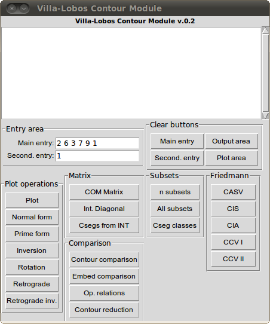
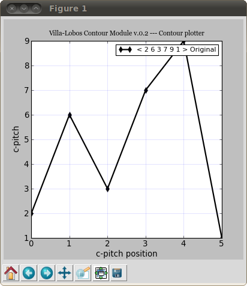
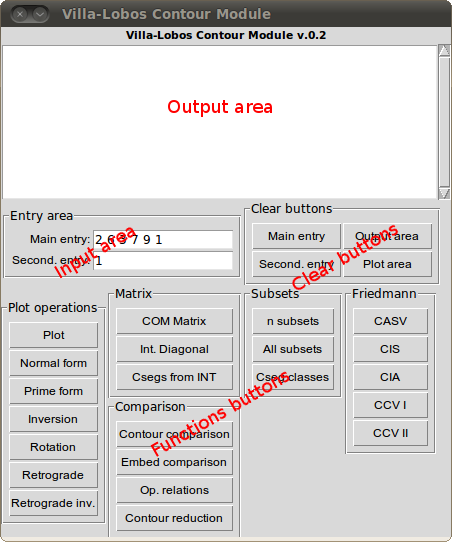
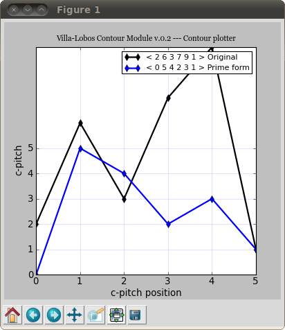

User documentation - Release 0.2
================================

Released in November 11th, 2010.

Installing
----------

To install VLCM look at `install documentation <install.html>`_.

Running
-------

On Linux
~~~~~~~~

To run |VLCM| GUI in Linux you have to open a terminal, change to
contour-module directory, and run one of these commands::

 python vlcm.py

or::

 ./vlcm.py

On Windows
~~~~~~~~~~

To run |VLCM| GUI in Windows, double-click vlcm.py
file.

Plotting a contour and an operation
-----------------------------------

If you are not patient to read this documentation, just run VLCM and
press plot button. The contour segment in `Input text area`_ will be
plotted in `Plot frame`_. Press any other button to have `Contour
operations <contour-operations.html>`_, or change contour segment to
your own choice.

.. index:: Graphic User Interface (GUI)

Graphic User Interface (GUI)
----------------------------

The current GUI for VLCM is made up of `Main frame`_ and `Plot
frame`_.





.. index:: Main frame

Main frame
~~~~~~~~~~

This is the VLCM `Main frame`_:


The gui is divided in four parts:

1. `Output text area`_
2. `Input text area`_
3. `Functions buttons`_
4. `Clear buttons`_




.. index:: Output text area

Output text area
................

The Output text area has the same features of a simple text editor. To
erase data use backspace or delete keys. It's possible to copy data to
another text editor, like Emacs, and also to edit the data inside
area.

.. index:: Input text area

Input text area
................

Input text area has two text entries: main entry (for contour segment or
internal diagonal), and second entry (for parameter or a secondary
contour segment).

Contour segments entry accepts only numbers and spaces::

 5 3 4 1 2 0

Internal diagonals must be entered with 1 and -1, like::

 1 -1 1

Parameter entry accepts only numbers. This entry is used with
functions rotation, internal diagonal, n-subsets, and Contour segments
for an internal diagonal.

.. index:: Functions buttons

Functions buttons
.................

Functions buttons comprise all `Contour operations
<contour-operations.html>`_ available in VLCM. To make an operation
insert the contour and parameter (if necessary) in `Input text area`_,
and click the button you choose.

The Plot button generates the given contour plotting.

.. index:: Clear buttons

Clear buttons
.............

Clear buttons erases plot area, output area, main and secondary
entries areas.

.. index:: Plot frame

Plot frame
``````````

`Plot frame`_ shows VLCM contour output plotting. This frame includes
a bottom toolbar with navigation, pan, zoom, adjust, and save
tools. So, it's possible to save a png file with the plotted contour.


The plotted contour has a top-right legend. `Plot frame`_ superposes
contour plotting when two or more functions are choosen in `Functions
buttons`_.



.. |VLCM| replace:: Villa-Lobos Contour Module
