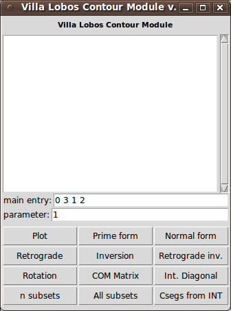
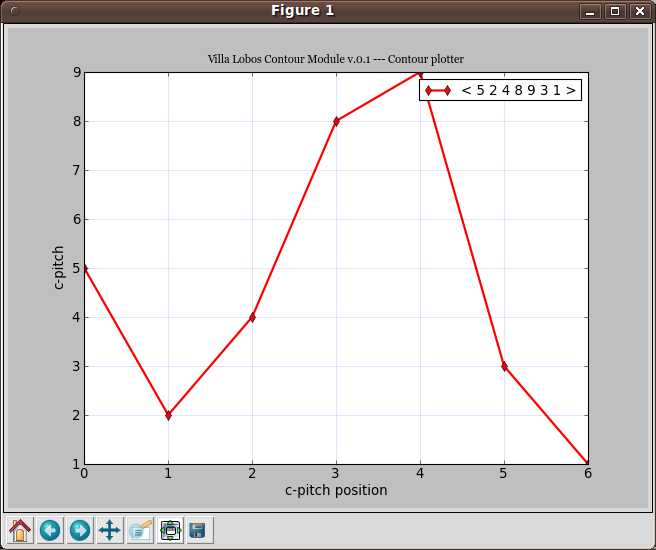
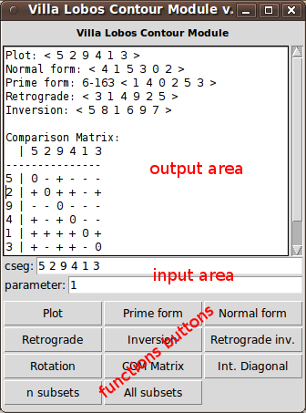

User documentation - Release 0.1
================================

Installing and Running
----------------------

To install and run VLCM look at `install documentation
<install.html>`_.

Plotting a contour and an operation
-----------------------------------

If you are not patient to read this documentation, just run VLCM and
press plot button. The contour segment in `Input text area`_ will be
plotted in `Plot frame`_. Press any other button to have `Contour
operations <contour-operations.html>`_, or change contour segment to
your own choice.

.. index:: Graphic User Interface (GUI)

Graphic User Interface (GUI)
----------------------------

The current GUI for VLCM is made up of `Main frame`_ and `Plot
frame`_.





.. index:: Main frame

Main frame
``````````
This is the VLCM `Main frame`_:


The gui is divided in three parts:

1. `Output text area`_
2. `Input text area`_
3. `Functions buttons`_



.. index:: Output text area

Output text area
................

The Output text area has the same features of a simple text editor. To
erase data use backspace or delete keys. It's possible to copy data to
another text editor, like Emacs, and also to edit the data inside
area.

.. index:: Input text area

Input text area
................

Input text area has two text entries: cseg (contour segment), and
parameter.

Contour segments entry accepts only numbers and spaces. The csegs must
be entered with just one space between cpitches, like::

 5 3 4 1 2 0

Parameter entry accepts only numbers. This entry is used with
functions like rotation, and internal diagonal.

.. index:: Functions buttons

Functions buttons
.................

Functions buttons comprise all `Contour operations
<contour-operations.html>`_ available in VLCM. To make an operation
insert the contour and parameter (if necessary) in `Input text
areas`_, and click the button you choose.

The Plot button generates the given contour plotting.

.. index:: Plot frame

Plot frame
``````````

`Plot frame`_ shows VLCM contour output plotting. This frame includes
a bottom toolbar with navigation, pan, zoom, adjust, and save
tools. So, it's possible to save a png file with the plotted contour.


The plotted contour has a top-right legend. `Plot frame`_ superposes
contour plotting when two or more functions are choosen in `Functions
buttons`_.

.. image:: figs/villa-lobos-gui-plot-frame-contours.png

